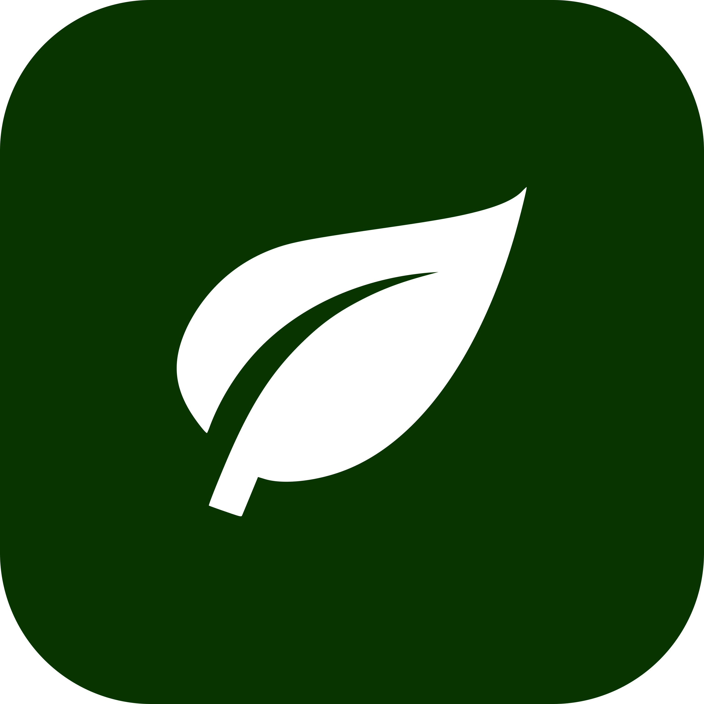
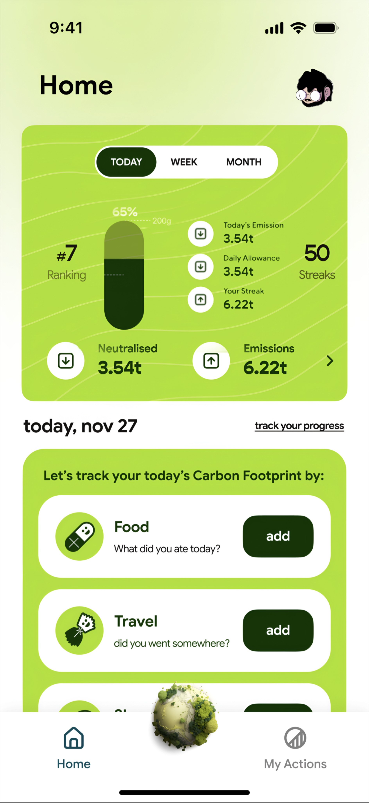
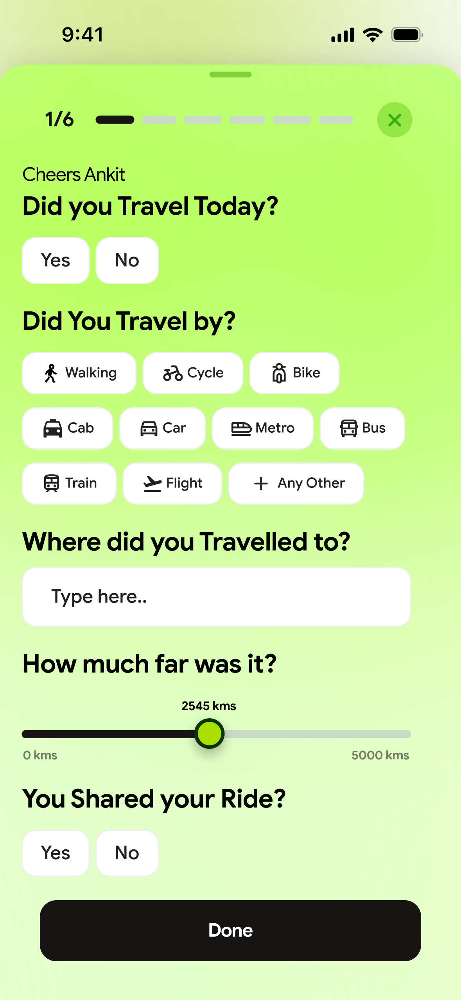
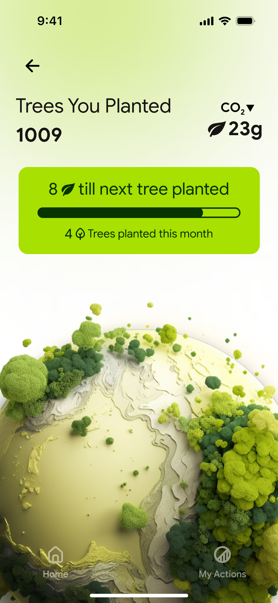
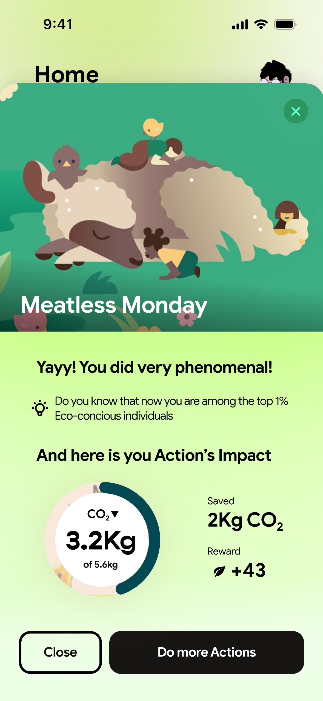

# 🌿 Releaf — Carbon Footprint Tracker

<div align="center">



**Track. Offset. Repeat.**

*An iOS app that transforms carbon footprint awareness into an interactive, gamified experience — built with Apple's SceneKit, SwiftUI, and Firebase.*

[](https://swift.org)
[](https://developer.apple.com/swiftui/)
[](https://firebase.google.com)
[](https://developer.apple.com/scenekit/)
[](https://apple.com/ios)
[](LICENSE)

[📱 Demo Video](#demo) • [📸 Screenshots](#screenshots) • [🏗 Architecture](#architecture) • [👤 My Role](#my-role)

</div>

---

## 🧠 The Problem

Most people *want* to reduce their carbon footprint — but have no idea where to start. Existing tools are either too complex, too vague, or frustratingly unengaging. Spreadsheets don't motivate behaviour change. Generic tips feel disconnected from real life.

**Releaf** solves this by making carbon tracking *personal*, *visual*, and *rewarding* — through a living 3D world that literally grows or shrinks based on your daily choices.

---

## ✨ What It Does

Releaf lets users log their daily activity across three key emission categories — **transport**, **diet**, and **energy usage** — and instantly see their carbon footprint visualised in a responsive 3D environment called the **Eco-sphere**.

The Eco-sphere is a virtual world where trees grow when you make eco-conscious choices, and wither when you don't. It's not just a gimmick — it's a behaviour-design tool that makes abstract CO₂ data feel real and motivating.

---

## 🔑 Key Features

| Feature | Description |
|---|---|
| 🌍 **Carbon Calculator** | Tracks daily emissions across transport, diet & energy with smart input forms |
| 🌳 **Eco-sphere (3D World)** | Interactive SceneKit environment — trees grow as your footprint shrinks |
| 📊 **Progress Dashboard** | Visual charts and history showing improvement over time |
| 🔐 **Firebase Auth** | Secure email/password authentication and persistent user sessions |
| ☁️ **Cloud Sync** | Real-time Firestore sync — your data follows you across all iOS devices |
| 🎯 **Actionable Tips** | Contextual guidance based on your highest-emission categories |

---

## 📱 Screenshots

<div align="center">

| Home / Dashboard | Carbon Input | Eco-sphere (3D) | Progress History |
|:---:|:---:|:---:|:---:|
|  |  |  |  |

</div>

> 📂 Full resolution screenshots are in [`/docs/screenshots`](docs/screenshots/)

---

## 🎥 Demo

<div align="center">

[](docs/demo/releaf_demo.mp4)

*Click to watch the demo — showing the full user flow from login → carbon input → Eco-sphere response*

</div>

---

## 🏗 Architecture

```
Releaf/
├── App/
│   └── ReleafApp.swift              # App entry point
├── Views/
│   ├── Auth/
│   │   ├── LoginView.swift
│   │   └── SignUpView.swift
│   ├── Dashboard/
│   │   ├── HomeView.swift
│   │   └── ProgressChartView.swift
│   ├── Input/
│   │   ├── TransportInputView.swift
│   │   ├── DietInputView.swift
│   │   └── EnergyInputView.swift
│   └── Ecosphere/
│       └── EcosphereSceneView.swift  # SceneKit integration
├── Models/
│   ├── CarbonEntry.swift
│   ├── UserProfile.swift
│   └── EmissionCategory.swift
├── Services/
│   ├── FirebaseAuthService.swift
│   ├── FirestoreService.swift
│   └── CarbonCalculatorService.swift
├── SceneKit/
│   ├── EcosphereScene.swift          # 3D scene setup & management
│   ├── TreeNode.swift                # Procedural tree rendering
│   └── SceneAnimationController.swift
└── Resources/
    ├── Assets.xcassets
    └── 3DAssets/
        └── ecosphere.scn
```

---

## 👤 My Role

I led this project end-to-end as **Team Lead and Primary Engineer**, driving both the technical architecture and team execution.

### 🎯 Technical Ownership

**SceneKit / 3D Eco-sphere** *(most complex component)*
- Architected the entire 3D interactive environment from scratch using Apple's SceneKit framework
- Engineered a dynamic tree-rendering system where tree growth/decay is directly tied to the user's real-time carbon score
- Solved the core UX challenge of making abstract CO₂ data emotionally resonant through 3D visual feedback
- Implemented smooth scene animations and camera transitions for a polished, game-like feel

**UI/UX Design & SwiftUI Implementation**
- Designed the complete app UI from wireframes to final implementation — every screen, flow, and interaction pattern
- Built all SwiftUI views with a focus on accessibility, smooth navigation, and a clean green-forward visual identity
- Iterated on the input flow based on usability testing feedback from the team

**Firebase Architecture**
- Integrated Firebase Authentication for secure user login and session management
- Designed the Firestore data schema for carbon entries, ensuring efficient reads/writes and real-time cross-device sync

### 👥 Team Leadership

- Led a 4-person team (Skand Gupta, Ankit Verma, Nimit Kumar) through the full product lifecycle: ideation → design → development → testing → final demo
- Ran structured sprint reviews and task delegation to keep the project on schedule
- Presented the final product at the iSDP Galgotias University showcase

---

## 🛠 Tech Stack

| Layer | Technology |
|---|---|
| **Language** | Swift 5.9 |
| **UI Framework** | SwiftUI |
| **3D Engine** | Apple SceneKit |
| **Backend / Auth** | Firebase Authentication |
| **Database** | Firebase Firestore (NoSQL, real-time) |
| **IDE** | Xcode 15 |
| **Version Control** | Git + GitHub |
| **Project Management** | Agile sprints (university iSDP programme) |

---

## 🚀 Getting Started

### Prerequisites
- Xcode 15+
- iOS 16+ device or simulator
- A Firebase project (free tier is fine)
- CocoaPods or Swift Package Manager

### Setup

```bash
# 1. Clone the repo
git clone https://github.com/NishantSinha7/Releaf.git
cd Releaf

# 2. Install dependencies (if using CocoaPods)
pod install

# 3. Add your Firebase config
# Download GoogleService-Info.plist from your Firebase console
# Drag it into the Releaf/ folder in Xcode

# 4. Open the workspace
open Releaf.xcworkspace

# 5. Build & Run on simulator or device
```

> ⚠️ **Note:** You'll need to set up your own Firebase project and add the `GoogleService-Info.plist` file. The original config file is not included for security reasons.

---

## 🗺 Roadmap

- [x] Carbon footprint calculator (transport, diet, energy)
- [x] 3D Eco-sphere with real-time tree growth
- [x] Firebase Auth + Firestore sync
- [x] Progress history and dashboard
- [ ] Social sharing — share your eco-score
- [ ] Push notification reminders for daily logging
- [ ] Streak system and achievements
- [ ] Apple Watch companion app
- [ ] App Store release

---

## 📂 Wireframes & Design

Early-stage wireframes created during the design sprint are in [`/docs/wireframes`](docs/wireframes/).

The design language uses a nature-forward palette (deep greens, earth tones) with clean SwiftUI components — intentionally calm and grounding rather than alarm-inducing.

---

## 👥 Team

| Name | Role |
|---|---|
| **Nishant Sinha** *(me)* | Team Lead · SceneKit Engineer · UI/UX Design |
| Skand Gupta | iOS Development |
| Ankit Verma | iOS Development |
| Nimit Kumar | iOS Development |

**Mentor:** Shruti Ma'am, Galgotias University
**Programme:** iSDP (iOS Student Developer Programme), 2024

---

## 🏆 Recognition

- 🥇 **App of the Day** — selected and showcased at the iSDP Galgotias University demo event
- Featured among top projects in the iOS Student Developer Programme cohort

---

## 📄 License

This project is licensed under the MIT License — see [LICENSE](LICENSE) for details.

---

<div align="center">

Made with 🌿 by [Nishant Sinha](https://github.com/NishantSinha7) · [LinkedIn](https://linkedin.com/in/your-linkedin) · [Portfolio](https://your-portfolio.com)

*Built as part of the iSDP programme at Galgotias University, 2024*

</div>
